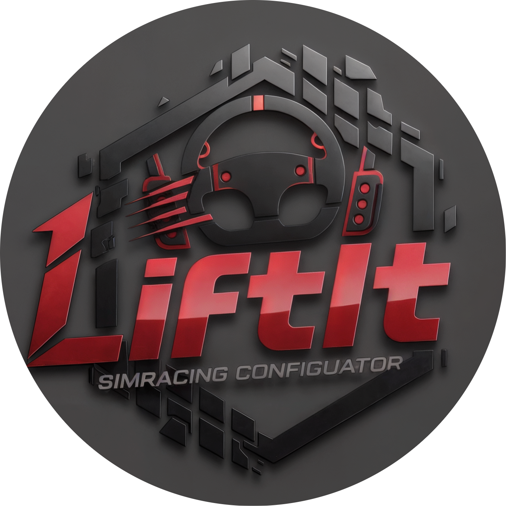
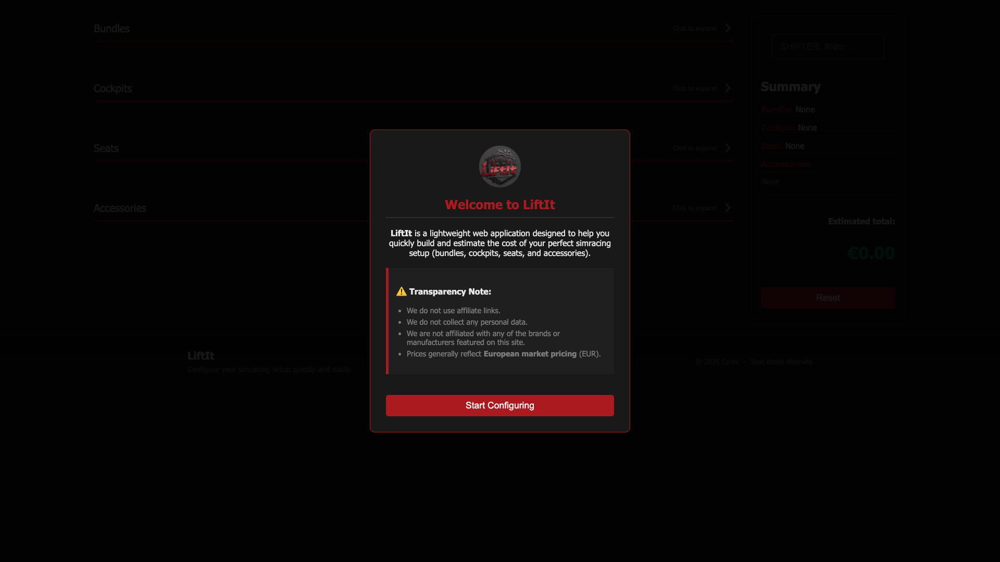
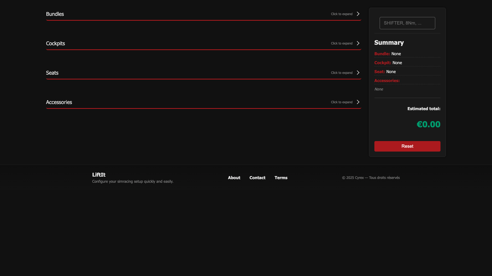
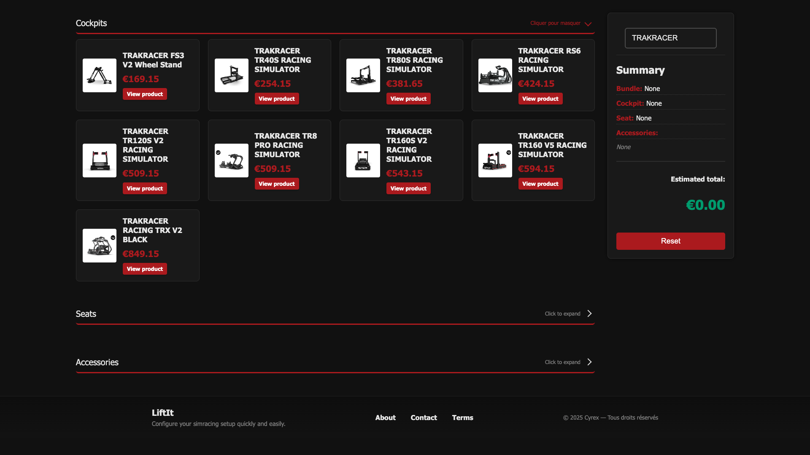
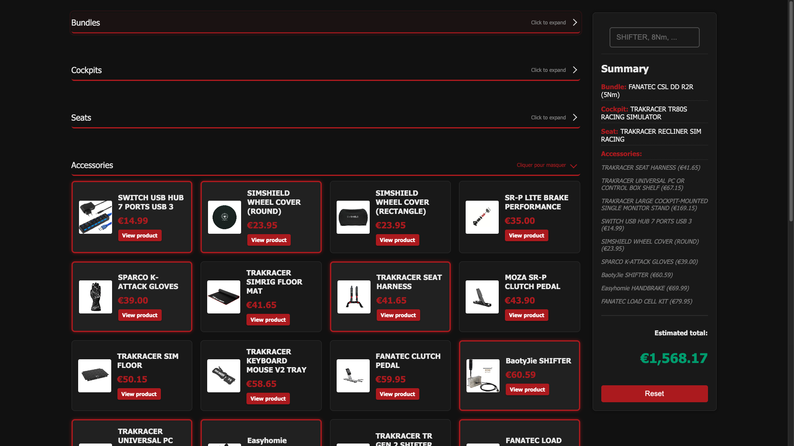

<div align="center">
    
</div>

<h1 align="center">LiftIt</h1>

<div align="center">
   <p>Lightweight web application to configure and estimate a simracing setup (bundles, cockpits, seats and accessories).</p>
   
   
   
   
   
</div>

## Table of contents

- [Overview](#overview)
- [How to use](#how-to-use)
- [Features](#features)
- [Local demo](#local-demo)
- [Project structure](#project-structure)
- [Contributing](#contributing)

## Overview

LiftIt is a simple client-side interface to build a simracing configuration by selecting a bundle, a cockpit, a seat, and accessories. The app calculates the estimated total, persists the selection in the browser (`localStorage`), and provides a clear summary.

The interface is designed to run directly in the browser without any backend.

## How to use

1. Clone the repository:

```bash
git clone https://github.com/LoupesDEV/LiftIt.git
```

2. Open the application:

- With **VSCode**: right-click `index.html` → *Open with Live Server* (extension recommended).
- With **Python** (simple local server):

```bash
python -m http.server 8000
# then open http://localhost:8000
```

3. Browse the interface, select the desired items and check the summary in the right-hand panel.

## Features

- **Simple selection**: Choose a bundle, a cockpit, a seat and accessories.
- **Multiple accessory selection**: Add/remove multiple accessories.
- **Dynamic summary**: Instant preview of the selection (names and prices).
- **Total calculation**: Automatic sum of selected items.
- **Client-side persistence**: Save the configuration in `localStorage` for later.
- **Reset**: Button to reset the configuration to zero.
- **Product links**: Cards may include a link to the product page (opens in a new tab).

## Local demo

You can try the app [here](https://www.matheo-pichotmoise.fr/LiftIt).

<div align="center">
    <table>
        <tr>
            <td></td>
            <td></td>
        </tr>
        <tr>
            <td></td>
            <td></td>
        </tr>
    </table>
</div>

## Project structure

```
LiftIt
├─ assets/                # Folder containing media
├─ CODE_OF_CONDUCT.md     # Code of conduct for contributors
├─ CONTRIBUTING.md        # Contribution guide
├─ data.json              # Equipment data
├─ index.html             # Main application page
├─ LICENSE                # License file
├─ README.md              # Project documentation
├─ script.js              # Script file
└─ styles.css             # Styles file
```

## Contributors

Thanks to the people and resources that contributed to the project:

- [LoupesDEV](https://github.com/LoupesDEV) — Main development, design and maintenance.

Want to contribute? Check the [contribution guide](CONTRIBUTING.md) or open an *issue* to propose improvements.

<p align="center">
    
    <br><br>
    
</p>